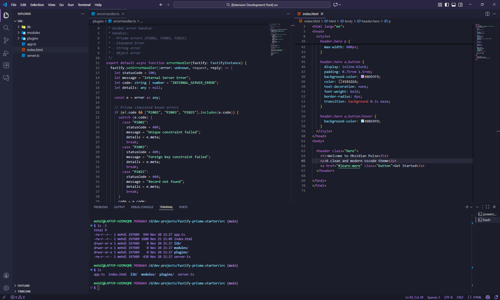
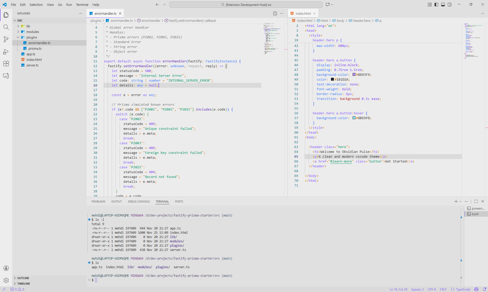

# Obsidian Pulse Theme

Obsidian Pulse is a **professional VS Code theme**, available in **Dark and Light modes**, designed for long coding sessions. It is easy on the eyes with subtle contrasts and elegant color accents.

---

## Theme Preview

### Dark Mode

  

### Light Mode

  

---

## Installation

1. Open VS Code.
2. Go to the **Extensions** panel (`Ctrl+Shift+X`).
3. Search for **"Obsidian Pulse Theme"**.
4. Click **Install**.
5. Activate the theme via the command palette `Ctrl+K T`.

---

## Features

- **Two variants**: Dark & Light (soft gray Light mode, not harsh white)
- **Colored syntax**: variables, functions, keywords, and strings for better readability
- **UI accents**: sidebar, tabs, status bar, and buttons with violet highlights
- **Eye-friendly**: ideal for long coding sessions

---

## Theme Files

- `obsidian-pulse-dark-color-theme.json`
- `obsidian-pulse-light-color-theme.json`
- `package.json`
- `images/` (screenshots)
- `icon.png` (Marketplace icon)

---

